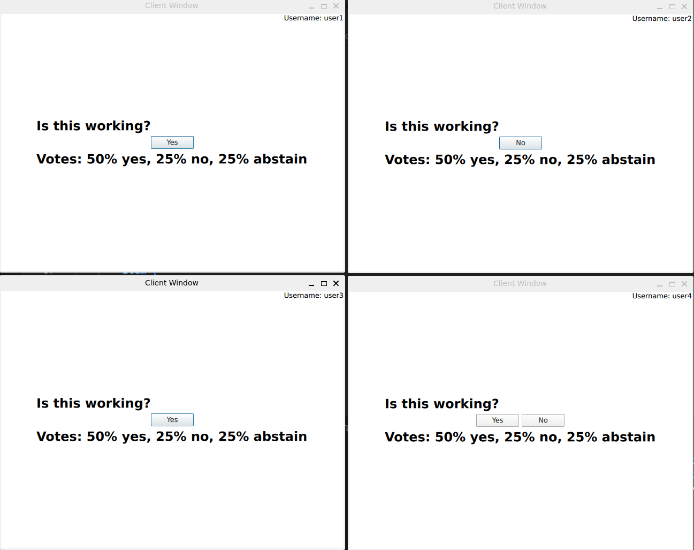

# QtSimpleVotingDemoApp

The purpose of this project is for me to experiment with a the [Qt Remote Objects](https://doc.qt.io/qt-6/qtremoteobjects-index.html) features. This is not production ready and things could've probably been a lot better.

There are 2 resulting executables:

1. server - contains all the logic
2. client - QML applications users use to vote and see statistics

There are 3 types of remote objects used:

1. Server - shared instance by all the clients with main server API
2. ClientChannel - used for direct communication between the server and a single client and store all the client data on the server side. One instance per client
3. VotingChannel - shared subobject of the Server to communicate the data for the current voting session

# Screenshot

